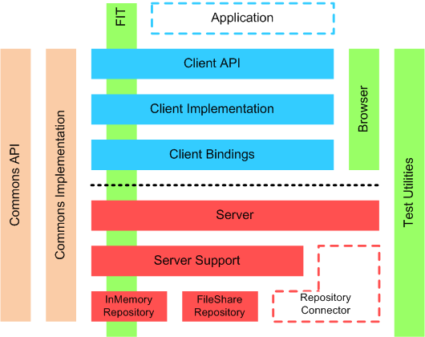

Title: OpenCMIS Modules
Breadcrumb: opencmis:modules

# OpenCMIS Modules

OpenCMIS is divided into four groups of modules:

* **chemistry-opencmis-commons**: Modules used by all other modules.
* **chemistry-opencmis-client**: CMIS client related modules.
* **chemistry-opencmis-server**: CMIS server framework related modules.
* **chemistry-opencmis-test**: Test modules that are not required at runtime.

## Module Description

### Commons

#### chemistry-opencmis-commons-api
Interfaces, enums and exceptions used across all other modules.

#### chemistry-opencmis-commons-impl
Implementations of the interface defined in chemistry-opencmis-commons-api.
It also generates and contains the JAXB classes.

### Client

#### chemistry-opencmis-client-api
Client API used by applications. See [OpenCMIS Client API](client/dev-client-api.html)
 for details.

#### chemistry-opencmis-client-impl
Implementations of the client API.

#### chemistry-opencmis-client-bindings
CMIS client AtomPub and Web Services binding implementation. See [OpenCMIS Client Bindings](client/dev-client-bindings.html)
 for details.

### Server

#### chemistry-opencmis-server-bindings
CMIS server AtomPub and Web Services binding implementation. See [OpenCMIS Server Framework](dev-server.html)
 for details.

#### chemistry-opencmis-server-support
Convenience classes for repository connectors. This module contains the
CMIS query parser.

#### chemistry-opencmis-server-inmemory
CMIS in-memory repository for test purposes. See [OpenCMIS InMemory Repository](repositories/dev-repositories-inmemory.html)
 for details.

#### chemistry-opencmis-server-fileshare
CMIS file system repository for test purposes. See [OpenCMIS FileShare Repository](repositories/dev-repositories-fileshare.html)
 for details.

#### chemistry-opencmis-server-jcr
CMIS to JCR bridge. See [OpenCMIS JCR Repository](repositories/dev-repositories-jcr.html)
 for details.

### Test

#### chemistry-opencmis-test-fit
Integration tests covering the whole stack.

#### chemistry-opencmis-test-browser
Simple web based CMIS client. See [OpenCMIS Browser](tools/dev-tools-browser.html)
 for details.

#### chemistry-opencmis-test-util
Utility classes for tests.

#### chemistry-opencmis-test-tools
Development tools.
 