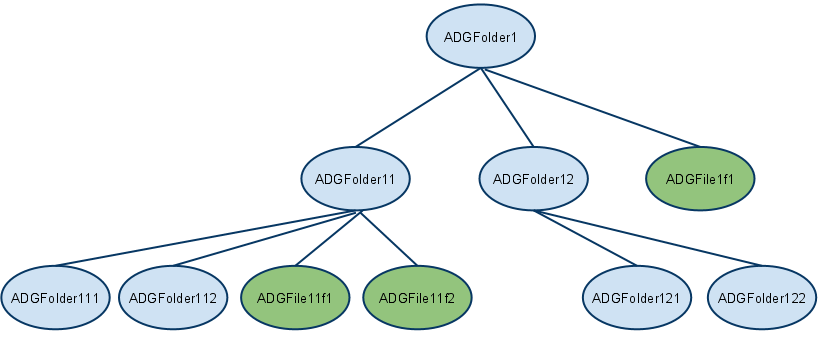

Title: OpenCMIS Client API Developer's Guide

# OpenCMIS Client API Developer's Guide

## Audience
This guide is for software engineers who want to use the Apache Chemistry OpenCMIS client to access CMIS-compliant
content repositories from Java code. The examples included in the guide assume the code is running in
a standalone Java application, but the OpenCMIS client can be used by on any Java platform, 
such as Web applications and phone apps.

### How to use this guide

The guide is divided into 5 parts :-

 1. *The Basics* - A brief introduction to CMIS and a practical "hello world" sample. Read this section to find out how to build, install and run a sample OpenCMIS application using Apache Chemistry.
 1. *Getting Started with OpenCMIS* - quick, practical examples of the the most commonly needed CMIS function.
 1. *Advanced CMIS features* - the rest of the CMIS API
 1. *OpenCMIS bindings* - the 2 CMIS 1.0 bindings, and when and how to use them.
 1. *Troubleshooting* - common pitfalls you may encounter when using OpenCMIS.
 
### Assumptions

The guide assumes you are using the Eclipse IDE for code development, and have Maven and SVN installed.

* You can download and install Eclipse [here](http://www.eclipse.org/downloads/).
* You can download and install Maven [here](http://maven.apache.org/download.html).
* You can download and install SVN for your platform [here](http://subversion.apache.org/packages.html).

## The basics

This section gives a high-level overview of the OpenCMIS library, and introduces a supplied "Hello World" sample to
get an OpenCMIS client up and running against a repository and accessing CMIS objects.

### What is OpenCMIS?

CMIS (Content Management Interoperability Services) is a vendor-neutral [OASIS Web services interface specification](http://www.oasis-open.org/committees/tc_home.php?wg_abbrev=cmis) 
that enables interoperability between Enterprise Content Management (ECM) systems. 
CMIS allows rich information to be shared across Internet protocols in vendor-neutral formats, 
among document systems, publishers and repositories, in a single enterprise and between companies.

OpenCMIS is a collection of Java libraries frameworks and tools based on the CMIS  specification. 
It is available under the open source [Apache License](http://www.apache.org/licenses/) from the
[Apache Chemistry project](http://chemistry.apache.org/).
The OpenCMIS Client API is a Java client-side library that implements the CMIS specification. You can see the Javadoc for the 
OpenCMIS Client API [here](http://chemistry.apache.org/java/0.8.0/maven/apidocs/org/apache/chemistry/opencmis/client/api/package-summary.html).
CMIS defines a domain model that describes a vendor-neutral ECM repository and its contents, a set of services to work with the 
repository and its content, and a set of bindings which a client uses to access the services.

#### The CMIS Domain Model

CMIS defines a domain model. A client will access a CMIS service endpoint described by a URL. A service endpoint must have at least one repository.
A repository is a data store and contains content. Each item of content is an object such as a folder, or a document.  A repository is identified by its ID, and has a set of capabilities which describe what optional 
CMIS functionality the repository supports. 

An object has an ID, has a type, and has set of properties for that type.
There are four base types for a CMIS object :-

* *Document* - is an item of content. The document may have a content stream, which is the actual file associated with the document. 
A content stream exists  only as part of its containing document object. A content stream has a mimetype associated with it.
A document object may contain one or more renditions, which are alternate views of the content.
Documents objects are  the only objects that are *versionable*. 
Each version of a document has its own object ID. All the versions of a document make up a version series and share a version series ID.
You can create, read, update and delete documents using OpenCMIS methods. 
* *Folder* - is a container used to organize the document objects. A repository had one root folder. All other folder objects 
have one parent folder. A folder has a folder path representing its place in the repository's folder hierarchy.
A folder object can have renditions. For example, a folder can have a thumbnail as a rendition representing the contents of the folder.
* *Relationship* - define relationships between a source object and a target object. 
Creating, changing and deleting relationships do not change the source or target objects themselves. 
Relationship objects are optional. A CMIS repository may not support relationship objects.
* *Policy* - are optional repository-specific objects that can be applied to controllable objects. The behavior of policies are not modeled by the CMIS specification. 
A  policy object may be applied to multiple controllable objects and a controllable object may have multiple policies applied to it. 
A policy object can not be deleted if it is currently applied to one or more controllable objects.

There can be other object types in the repository, defined in a repository as subtypes of these base types. 
CMIS services are provided for the discovery of object-types that are defined in a repository, but for the moment 
folders and documents are the main objects you will be concerned with for the first 2 parts of this document.

#### CMIS Services

The CMIS specification describes a set of services that act on repositories. The OpenCMIS client API uses these services, but by using a client binding,
presents the user of the API a simple set of classes rather than the services described by CMIS. If you want to access a CMIS repository at the service level, you can do that
by using the [OpenCMIS client bindings layer](http://chemistry.apache.org/java/developing/client/dev-client-bindings.html) directly.

The CMIS services are:-

* *Repository services* -  let you discover available repositories, get the capabilities of these repositories, and provide basic Data Dictionary information of what types are available in the repository.
* *Navigation services* -  let you navigate the repository by accessing the folder tree and traversing the folder/child hierarchy. You can use these services to get both children and parents of an object.
* *Object services* -  provide the basic CRUD (Create, Read, Update, Delete) and Control services on any object, including document, folder, policy, and relationship objects. For document objects, this
  includes setting and getting of properties, policies, and content streams. Object services retrieve objects by path or object ID. Applications may also discover what actions users are allowed to perform.
* *Multi-filing services* -  let you establish the hierarchy by adding or removing an object to or from a folder.
* *Discovery services* -  provide Query and Change services, and a means of paging the results of the query.
* *Change services* -  let you discover what content has changed since the last time checked, as specified by a special token. You can use Change services for external search indexing and replication services.
* *Versioning services* -  control concurrent operation of the Object services by providing Check In and Check Out services. Version services also provide version histories for objects that are versioned.
* *Relationship services* -  let you create, manage, and access relationships or associations between objects as well as allow an application to traverse those associations.
* *Policy services* -  apply policies on document objects. Policies are free-form objects and can be used by implementations for security, record, or control policies.
* *ACL services* - let you create, manage, and access Access Control Lists to control who can perform certain operations on an object.

#### CMIS Bindings

How does an OpenCMIS client communicate over the wire with a CMIS service endpoint? A CMIS repository can communicate over two protocols,
SOAP and [AtomPub](http://tools.ietf.org/html/rfc5023), and provide two corresponding bindings, a web services binding, and an AtomPub binding. A CMIS service endpoint will 
provide a URL for both types of binding, and in OpenCMIS you specify the binding type when calling the `getRepositories()` method on 
the [`SessionFactory`](http://chemistry.apache.org/java/0.8.0/maven/apidocs/org/apache/chemistry/opencmis/client/api/SessionFactory.html) object.

#### The OpenCMIS Workbench

The workbench is a GUI repository browser that lets you quickly view the contents of a repository, create documents and folders, look at metadata, and 
perform queries. It's really useful for debugging your applications, and for quickly testing out queries before you commit them to code. You can
download the latest version [here](http://chemistry.apache.org/java/developing/tools/dev-tools-workbench.html). The workbench is a Java Swing application, and comes 
with both Windows and UNIX starter scripts.

### Hello World
You can download, install, and test the Apache Chemistry client code using the `Hello World` sample. On a command line, type the following command :-

    svn co https://svn.apache.org/repos/asf/chemistry/opencmis/trunk/chemistry-opencmis-samples/chemistry-opencmis-hello

You can then build the sample and run the `org.apache.chemistry.opencmis.doc.Hello` sample using maven, by typing the following command

    mvn clean install

You will see some output towards the end of the build that looks similar to the following lines:-

    org.apache.chemistry.opencmis.doc.Hello started
    Found repository: InMemory Repository
    Got a connection to repository: InMemory Repository, with id: A1
    Found the following objects in the root folder:-
    MasterClass
    My_Document-0-0
    My_Document-0-1
    My_Document-0-2
    My_Folder-0-0
    My_Folder-0-1
    org.apache.chemistry.opencmis.doc.Hello ended    
    
The Hello World sample has connected to a public CMIS repository and retrieved all the objects in the root folder of that repository.
The simplest way to view the sample code is to use eclipse

1. Add the maven repository to your eclipse workspace classpath with the following command. You only need to perform this step once.

   ```
    mvn eclipse:configure-workspace -Declipse.workspace=<path-to-your-eclipse-workspace>
   ```
    
1. Create an Eclipse project from the code, and import it into your eclipse.
Type the following command :-

   ```
    mvn eclipse:eclipse
   ```

1. Import the project into eclipse:-
 
   1. click `File->Import` and choose `General->Existing projects into workspace` in the Import wizard.
   1. Click `Next` and  browse to the folder you checked out the project to.
   1. Click the checkbox next to `chemistry-opencmis-hello` project. The project will be imported into your workspace.

You can run the `main` method in the `Hello` class as a Java application.

Once you have successfully run the `Hello World` sample, you can start to get familiar with the core parts of the 
OpenCMIS API in the next section.

## Getting Started with OpenCMIS

This section introduces the most commonly used parts of the OpenCMIS client API. The code snippets are taken from the GettingStarted sample class supplied with Apache chemistry.

### Installing the getting started sample
On a command line, type the following command :-

    svn co https://svn.apache.org/repos/asf/chemistry/opencmis/trunk/chemistry-opencmis-samples/chemistry-opencmis-getting-started

You can then build the sample and run the `org.apache.chemistry.opencmis.doc.GettingStarted` sample using maven, by typing the following command

    mvn clean install
    
This will pull in any dependencies for the sample, build it, and run it against a public repository.

The simplest way to work with the getting started sample is to use Maven to create an eclipse project from the code, and import it into your eclipse.
To create the eclipse project type the following command :-

    mvn eclipse:eclipse

To import the project into eclipse:-
 
1. click `File->Import` and choose `General->Existing projects into workspace` in the 
Import wizard.
1. Click `Next` and  browse to the folder you checked out the project to.
1. Click the checkbox next to `chemistry-opencmis-gettingstarted` project. The project will be imported into your workspace.

You can run the `main` method in the `GettingStarted` class as a Java application.

### Connecting to a CMIS repository
To do any work on a repository, you must first find your repository, and create a session with it.
To do that, you create a SessionFactory, and set up a parameter map that describes the credentials
and connection settings for the target URL.  This code snippet uses the publicly accessible OpenCMIS InMemory Repository
which you will be sharing with everyone. There are other publicly accessible CMIS repositories which you can try your code out on, or 
you can change the code to use a repository local to you.
Note that:-

1. This repository does not require credentials, but the code snippet sets a user id and password to show how this is done
1. The code uses the `ATOMPUB` binding for connection. 

   ```java
    SessionFactory sessionFactory = SessionFactoryImpl.newInstance();
    Map<String, String> parameter = new HashMap<String, String>();
    parameter.put(SessionParameter.USER, "admin");
    parameter.put(SessionParameter.PASSWORD, "admin");
    parameter.put(SessionParameter.ATOMPUB_URL, "http://repo.opencmis.org/inmemory/atom/");
    parameter.put(SessionParameter.BINDING_TYPE, BindingType.ATOMPUB.value());
   ```

#### Connecting to a repository by id

In a production environment, the client code will probably know the ID of the repository that it wants to connect to.
The following code snippet shows how to connect to a repository using its ID.

```java
    parameter.put(SessionParameter.REPOSITORY_ID, "A1");
    Session session = sessionFactory.createSession(parameter);
```

That's it. Any work you want to do against the repository uses this session.
 
#### Connecting to one of a list of repositories       

The CMIS specification allows a CMIS service endpoint to advertise one or more repositories, so this code snippet retrieves a list of repositories. In this 
case there the code chooses the first repository in list:-

```java
    List<Repository> repositories = sessionFactory.getRepositories(parameter);
    for (Repository r : repositories) {
        System.out.println("Found repository: " + r.getName());
    }
```

Now you can create your session with the first and only repository:-

```:java
    Repository repository = repositories.get(0);
    Session session = repository.createSession();

    System.out.println("Got a connection to repository: " 
        + repository.getName() + ", with id: "
        + repository.getId());
```

That's it. Any work you want to do against the repository uses this session.

### Working with Folders and Documents

Of the four base objects described by the CMIS domain model, the most commonly used are the folder and the document.

A folder is a container for other objects. Folders exist in a  hierarchical structure as you would expect, but 
a CMIS repository can optionally store objects in multiple folders, and an object can exist but not be contained in a folder. 
CMIS uses the terminology multifiling and unfiling for these
capabilities.

The Document is the only object that can have content, described by a content stream, and has properties such as the author and modification date. 

#### Finding the contents of the root folder

Now you have a session you can start examining the repository. All CMIS repositories have a root folder, which is the single top level folder in the hierarchy.
To list the objects in the root folder of your repository you use the `getRootFolder()` method on the session.

```java
    Folder root = session.getRootFolder();
    ItemIterable<CmisObject> children = root.getChildren();

    System.out.println("Found the following objects in the root folder:-");
    for (CmisObject o : children) {
        System.out.println(o.getName() + " which is of type " + o.getType().getDisplayName());
    }
```

#### Creating a folder object

To create a folder, you use the  `createFolder()` method on the parent folder.
As with most CMIS methods, it takes a map of properties which define the Object to be created.
In this code snippet a folder with the name `ADGNewFolder` is created in the root folder:-

```java
    System.out.println("Creating 'ADGNewFolder' in the root folder");
    Map<String, String> newFolderProps = new HashMap<String, String>();
    newFolderProps.put(PropertyIds.OBJECT_TYPE_ID, "cmis:folder");
    newFolderProps.put(PropertyIds.NAME, "ADGNewFolder");

    Folder newFolder = root.createFolder(newFolderProps);

    // Did it work?
    ItemIterable<CmisObject> children = root.getChildren();
    System.out.println("Now finding the following objects in the root folder:-");
    for (CmisObject o : children) {
        System.out.println(o.getName());
    }      
```

Note that the properties set for in the above code snippet are the minimum set of name and object type id. 
There are many other properties you can set on creation, depending on the object type.
        
#### Creating a simple document object

Document objects describe entities in the CMIS repository. A document object with content
contains a content stream that is the actual file contents, and a mimetype for the content stream. 
So, to create a document Object, first you need a content stream

```java
    final String textFileName = "test.txt";
    System.out.println("creating a simple text file, " + textFileName);

    String mimetype = "text/plain; charset=UTF-8";
    String content = "This is some test content.";
    String filename = textFileName;
         
    byte[] buf = content.getBytes("UTF-8");
    ByteArrayInputStream input = new ByteArrayInputStream(buf);

    ContentStream contentStream = session.getObjectFactory().createContentStream(filename, buf.length, mimetype, input);
```

To add a document with some content to the repository, you use the `createDocument()` method on the parent folder, and provide the content stream
and a map of properties which define the object to be created.

```java
    Map<String, Object> properties = new HashMap<String, Object>();
    properties.put(PropertyIds.OBJECT_TYPE_ID, "cmis:document");
    properties.put(PropertyIds.NAME, filename);

    Document doc = newFolder.createDocument(properties, contentStream, VersioningState.MAJOR);

    System.out.println("Document ID: " + doc.getId());
```

Note the following points :-
         
* The `createDocument()` method returns the newly created document object. 
* Each version of a document object has its own object ID.
* You can create a document without an associated content stream, by passing null as the contentStream Parameter.

#### Reading the contents of a document object

You can retrieve a CMIS object by path, or by using the object ID.

The following code snippet retrieves the newly created object using the object ID:-

```java
    // Get the contents of the file
    Document doc = (Document) session.getObject(id);
    ContentStream contentStream = doc.getContentStream(); // returns null if the document has no content
    if (contentStream != null) {
        String content = getContentAsString(contentStream);
        System.out.println("Contents of " + filename + " are: " + content);
    } else {
        System.out.println("No content.");
    }

    ...
        
    /**
     * Helper method to get the contents of a stream
     * 
     * @param stream
     * @return
     * @throws IOException
     */
    private static String getContentAsString(ContentStream stream) throws IOException {
        StringBuilder sb = new StringBuilder();
        Reader reader = new InputStreamReader(stream.getStream(), "UTF-8");

        try {
            final char[] buffer = new char[4 * 1024];
            int b;
            while (true) {
                b = reader.read(buffer, 0, buffer.length);
                if (b > 0) {
                    sb.append(buffer, 0, b);
                } else if (b == -1) {
                    break;
                }
            }
        } finally {
            reader.close();
        }

        return sb.toString();
    }
```

The following code snippet retrieves the newly created object using a path:-

```java
    String path = newFolder.getPath() + "/" + textFileName;
    System.out.println("Getting object by path " + path);

    Document doc = (Document) session.getObjectByPath(path);
    ContentStream contentStream = doc.getContentStream();
    if (contentStream != null) {
        String content = getContentAsString(contentStream);
    }
```

Note the following points :-

* All paths start with the root folder `/`. 
* The [`Document`](http://chemistry.apache.org/java/0.8.0/maven/apidocs/org/apache/chemistry/opencmis/client/api/Document.html) 
class does not have a `getPath()` method, since multifiling means a document can have more than one parent folder. It does implement the 
`getPaths()` method from the [`FileableCmisObject`](http://chemistry.apache.org/java/0.8.0/maven/apidocs/org/apache/chemistry/opencmis/client/api/FileableCmisObject.html) interface. 
This returns a list of the current paths to the document object. 

#### Updating a document.

You can update the properties of a document object, and you update the contents of the document by overwriting the document's content stream with a new content stream.
Note that the object ID returned when updating a document is not guaranteed to remain the same, some repository implementations return the same object ID, and some may not.

The following code snippet updates the name property of the `test2.txt` document:-

```java
    Document doc2 = (Document) session.getObject(id2);        
    System.out.println("renaming " + doc2.getName() + " to test3.txt");

    Map<String, String> properties = new HashMap<String, Object>();
    properties.put(PropertyIds.NAME, "test3.txt");

    doc2.updateProperties(properties, true);

    System.out.println("renamed to " + doc2.getName());
```

You can update the contents of a document by setting a new [ContentStream](http://chemistry.apache.org/java/0.8.0/maven/apidocs/org/apache/chemistry/opencmis/commons/data/ContentStream.html) 
using the `setContentStream()` method.
You must set the overwrite flag if the document has existing content, otherwise an exception will be thrown. The following code snippet updated the content of the `test3.txt` document:-

```java
    if (!session.getRepositoryInfo().getCapabilities().getContentStreamUpdatesCapability()
            .equals(CapabilityContentStreamUpdates.ANYTIME)) {
        System.out.println("update without checkout not supported in this repository");
    } else {
        System.out.println("updating content stream");

        String mimetype = "text/plain; charset=UTF-8";
        String content = "This is some updated test content for our renamed second document.";
        byte[] buf = content.getBytes("UTF-8");
        input = new ByteArrayInputStream(buf);

        ContentStream contentStream = session.getObjectFactory().createContentStream("test3.txt", buf.length, mimetype, input);

        doc2.setContentStream(contentStream, true);

        // did it work?
        contentStream = doc2.getContentStream();

        if (contentStream != null) {
            content = getContentAsString(contentStream);
            System.out.println("Contents of " + doc2.getName() + " are: " + content);
        } else {
            System.out.println("Something went wrong.");
        }
    }
```

Note that this code snippet will not work for repositories that require a checkout to set a  content stream.
For more information on checkout see the <a href="#Versioning">versioning</a> section in this guide.
        
#### Deleting a document

You can delete any CMIS object using the `delete` method. The following code snippet lists the 
contents of the test folder before and after a delete of one of the two documents
in the folder.

```java
    ItemIterable<CmisObject> children = newFolder.getChildren();
    System.out.println("Now finding the following objects in our folder:-");

    for (CmisObject o : children) {
        System.out.println(o.getName());
    }

    System.out.println("Deleting document " + doc2.getName());
    doc2.delete(true);

    System.out.println("Now finding the following objects in our folder:-");
    for (CmisObject o : children) {
       System.out.println(o.getName());
    }
```

Note that the `allVersions` flag is set to `true`. If you set it to false then the delete will
be of this version only.

#### Deleting a folder tree

You can delete a folder and all its contents using just one method. The following code snippet
creates a new folder tree and then deletes it, ignoring any failures to delete individual objects, and deleting
all versions of any documents in the tree.

```java
        System.out.println("Creating 'ADGFolder1' in the root folder");
        Map<String, String> newFolderProps = new HashMap<String, String>();
        newFolderProps.put(PropertyIds.OBJECT_TYPE_ID, "cmis:folder");
        newFolderProps.put(PropertyIds.NAME, "ADGFolder1");
        Folder folder1 = root.createFolder(newFolderProps);

        newFolderProps.put(PropertyIds.NAME, "ADGFolder11");
        Folder folder11 = folder1.createFolder(newFolderProps);

        newFolderProps.put(PropertyIds.NAME, "ADGFolder12");
        Folder folder12 = folder1.createFolder(newFolderProps);

        System.out.println("delete the 'ADGFolder1' tree");        
        folder1.deleteTree(true, UnfileObject.DELETE, true);  
```

Note that with the continueOnFailure parameter set to true, folders and documents are deleted individually. 
If a document or folder cannot be deleted, the method moves to the next document or folder in the list.
When the method completes, it returns a list of the document IDs and folder IDs that were not deleted.

With the continueOnFailure parameter set to false, all of the folders and documents can be deleted in a single batch, 
which, depending on the repository design, may improve performance. If a document or folder cannot be deleted, 
an exception is raised. Some repository implementations will attempt the delete transactionally, so if it fails,
no objects are deleted. In other repositories a failed delete may have deleted some, but not all, objects in the tree.

#### Navigating through a folder tree

CMIS provides several concepts for navigating through the tree of objects in the repository. For any folder, 
you can get its children, get its descendants, and get the folder tree. The getting started sample application sets
up a tree in the repository that looks like this:-



The following snippet from the getting started sample will print out the children of a folder :-

```java
    ItemIterable<CmisObject> children = folder1.getChildren();
    System.out.println("Children of " + folder1.getName() + ":-");
    for (CmisObject o : children) {
        System.out.println(o.getName());
    }
```

Note that the children of a Folder object can be of any type supported by the repository. 
Running the sample produces the following output :-

    Children of ADGFolder1:-
    ADGFolder11
    ADGFolder12
    ADGFile1f1

If your repository supports `getDescendants`, you can navigate the whole subtree of descendants of any folder. 
This code snippet uses a recursive method to print out the entire folder subtree:-

```java
    if (!session.getRepositoryInfo().getCapabilities().isGetDescendantsSupported()) {
        System.out.println("getDescendants not supported in this repository");
    } else {
        System.out.println("Descendants of " + folder1.getName() + ":-");
        for (Tree<FileableCmisObject> t : folder1.getDescendants(-1)) {
            printTree(t);
        }
    }
    
    ...

    private static void printTree(Tree<FileableCmisObject> tree) {
        System.out.println("Descendant " + tree.getItem().getName());
        for (Tree<FileableCmisObject> t : tree.getChildren()) {
            printTree(t);
        }
    }
```

Note the following points:-

1. The children of a [`Tree`](http://chemistry.apache.org/java/0.8.0/maven/apidocs/org/apache/chemistry/opencmis/client/api/Tree.html) are themselves of type `Tree`. 
1. The single argument of `getDescendants` is the depth or level of the tree that you want to go to. A depth of 1 will give you just the root of the tree. 
   A depth of -1 will return the full tree.

Running the sample produces the following output :-

    Descendants of ADGFolder1:-
    Descendant ADGFolder11
    Descendant ADGFolder111
    Descendant ADGFolder112
    Descendant ADGFile11f1
    Descendant ADGFile11f2
    Descendant ADGFolder12
    Descendant ADGFolder121
    Descendant ADGFile121f1
    Descendant ADGFolder122
    Descendant ADGFile1f1
    
If your repository supports `getFolderTree`, you can navigate the whole subtree of folders from any folder in the repository.
This code snippet uses a recursive method to print out the entire folder subtree:-

```java
    if (!session.getRepositoryInfo().getCapabilities().isGetFolderTreeSupported()) {
        System.out.println("getFolderTree not supported in this repository");
    } else {
        System.out.println("Foldertree for " + folder1.getName() + ":-");
        for (Tree<FileableCmisObject> t : folder1.getFolderTree(-1)) {
            printFolderTree(t);
        }
    }
    
    ...
            
    private static void printFolderTree(Tree<FileableCmisObject> tree) {
        System.out.println("Folder " + tree.getItem().getName());
        for (Tree<FileableCmisObject> t : tree.getChildren()) {
            printFolderTree(t);
        }
    }
```

Running the sample produces the following output :-

    Foldertree for ADGFolder1:-
    Folder ADGFolder11
    Folder ADGFolder111
    Folder ADGFolder112
    Folder ADGFolder12
    Folder ADGFolder121
    Folder ADGFolder122
    
Note that `getDescendants` and `getFolderTree` are similar, but `getDescendants` finds objects of any fileable type, `getFolderTree` finds only folder
objects.

<a name="ObjectTypes"></a>     
### Object Types

CMIS Objects have an object type. There are four base types, two of which *must* be supported by a repository 

* `cmis:document`
* `cmis:folder` 

The other two base types *may* be supported by a repository :-

* `cmis:relationship`
* `cmis:policy` 

Any other types in a repository must be defined as sub-types of a base type. 
An object type definition includes a set of attributes (for example Fileable, Queryable) 
and a property schema that will apply to Objects of that type.

Every object type has a parent type, except a base type.

CMIS 1.0 does not allow you to create types, but it does have allow you to navigate the object type tree, and look at type definitions.

So, we can retrieve information in the type definition for our `doc` object :-

```java
        System.out.println("Getting type definition for doc type");
        ObjectType objectType = session.getTypeDefinition(doc.getType().getId());
        System.out.println("isBaseType() returns " + (objectType.isBaseType() ? "true" : "false"));

        ObjectType baseType = objectType.getBaseType();
        if (baseType == null) {
            System.out.println("getBaseType() returns null");
        } else {
            System.out.println("getBaseType() returns " + baseType.getDisplayName());
        }

        ObjectType parentType = objectType.getParentType();
        if (parentType == null) {
            System.out.println("getParentType() returns null");
        } else {
            System.out.println("getParentType() returns " + parentType.getDisplayName());
        }

        System.out.println("Listing child types of " + objectType.getDisplayName());
        for (ObjectType o : objectType.getChildren()) {
            System.out.println("\t" + o.getDisplayName());
        }

        System.out.println("Getting immediate descendant types of " + objectType.getDisplayName());
        for (Tree<ObjectType> o : objectType.getDescendants(1)) {
            System.out.println("\t" + o.getItem().getDisplayName());
        }
```

The following lines are typical output from this code:-

    Getting type definition for doc type
    isBaseType() returns true
    getBaseType() returns null
    getParentType() returns null
    Listing child types of CMIS Document
        My Type 1 Level 1
        My Type 2 Level 1
        Complex type with properties, Level 1
        Document type with properties, Level 1
        VersionedType
    Getting immediate descendant types of CMIS Document
        My Type 1 Level 1
        My Type 2 Level 1
        Complex type with properties, Level 1
        Document type with properties, Level 1
        VersionedType
        
You will see that, not surprisingly, doc has a type of `Document`, which is a base type, so has no parent. Depending on the repository
you are running this code against, there may be a number of children of the `Document` type, which are types derived from this base type.

### CMIS Properties

#### Displaying the properties of an Object

All objects of the CMIS base types implement the interface [`CmisObjectProperties`](http://chemistry.apache.org/java/0.8.0/maven/apidocs/org/apache/chemistry/opencmis/client/api/CmisObjectProperties.html) which provides 
accessors to CMIS object properties. The following code snippet uses the `getProperties()` method
to print out all the available properties on a newly created Document object, doc.

```java
    List<Property<?>> props = doc.getProperties();
    for (Property<?> p : props) {
        System.out.println(p.getDefinition().getDisplayName() + "=" + p.getValuesAsString());
    }
```

The output should look something like this :-

    Is Latest Major Version=[false]
    Content Stream Length=[26]
    Content Stream Id=[store://2011/5/20/12/54/0d69ee48-ef03-4715-ae23-b84b4342315c.bin]
    Version Series Checked Out By=[]
    Object Type Id=[cmis:document]
    Version Series Checked Out Id=[]
    Name=[test.txt]
    Content Stream MIME Type=[text/plain; charset=UTF-8]
    Version series id=[workspace://SpacesStore/3cd2cbbf-1a00-4653-8ea8-1e91515c6092]
    Creation Date=[Fri May 20 12:54:47 BST 2011]
    Change token=[]
    Version Label=[0.0]
    Is Latest Version=[true]
    Is Version Series Checked Out=[false]
    Last Modified By=[admin]
    Created by=[admin]
    Checkin Comment=[]
    Object Id=[workspace://SpacesStore/3cd2cbbf-1a00-4653-8ea8-1e91515c6092]
    Is Immutable=[false]
    Is Major Version=[false]
    Base Type Id=[cmis:document]
    Content Stream Filename=[test.txt]
    Last Modified Date=[Fri May 20 12:54:47 BST 2011]
    
#### Getting a property explicitly
Each object type has a known set of properties, and you can retrieve these explicitly. 
For example, the document type has a set of properties described by the [`DocumentProperties`](http://chemistry.apache.org/java/0.8.0/maven/apidocs/org/apache/chemistry/opencmis/client/api/DocumentProperties.html) interface, 
and you can use the methods on this interface to retrieve 
the value a property:-

```java
    System.out.println("VersionLabel property on " + doc.getName() + " is "
            + doc.getVersionLabel());
    System.out.println("Is this the latest version of " + doc.getName() + " ?:  "
            + (doc.isLatestVersion() ? "yes" : "no"));
```

Note that properties can be of simple types, `Boolean`, String, long, or more complex types,
such as `GregorianCalendar`. The following code snippet prints out the `CreationDate` property:-

```java
    GregorianCalendar calendar = doc.getCreationDate();
    String DATE_FORMAT = "yyyyMMdd";
    SimpleDateFormat sdf = new SimpleDateFormat(DATE_FORMAT);
    System.out.println("Creation date of " + doc.getName() + " is  " + sdf.format(calendar.getTime()));
```

#### Getting a property value by Id

You can get the value of any property using the `getPropertyValue()` method. 
This is particularly useful for retrieving properties that are not part of the CMIS specification. 
The following code snippet takes a property, finds the Id from the property definition, and gets the 
property's value using the `queryName`:-

```java
    List<Property<?>> props = doc.getProperties();
    Property<?> someProperty = props.get(0);
    System.out.println(someProperty.getDisplayName() + " property on " + doc.getName()
        + " (by getPropertValue()) is "
        + doc.getPropertyValue(someProperty.getId())); 
```

#### Getting a property value by query name

Given a query result, you can always use the `queryName` to get a property value. 
The following code snippet performs a query and gets a property's value using the `queryName`:-

```java
    String query = "SELECT * FROM cmis:document WHERE cmis:name = 'test.txt'";
    ItemIterable<QueryResult> queryResult = session.query(query, false);
    for (QueryResult item : queryResult) {
        System.out.println("property cmis:createdBy on test.txt is "
                + item.getPropertyByQueryName("cmis:createdBy").getFirstValue());
    } 
```

### Working with CMIS Queries

CMIS provides a type-based query service for discovering objects that match specified criteria. To allow this, CMIS provides 
a relational view of the CMIS data model. Through this relational view, queries may be performed using a simplified SQL SELECT 
statement. The query language is based on a subset of the SQL-92 grammar, with some extensions to enhance filtering 
capability for the CMIS data model. You can see an explanation of relational view and the full query language grammar in the 
[CMIS Specification](http://docs.oasis-open.org/cmis/CMIS/v1.0/os/cmis-spec-v1.0.html#_Toc243905420). 

##### A Simple Query

Let's look at a query that will find all document objects that have a name that starts with the string `test`:-

```sql
    SELECT * FROM cmis:document WHERE cmis:name LIKE 'test%'
```

This query specifies the virtual table `cmis:document` in the FROM clause. In the CMIS relational view, a virtual table 
is implicitly defined for each queryable object type defined in the repository.
In each virtual table, virtual columns are implicitly defined for:-

* each property defined in the object type definition.  
* all properties defined on any ancestor-type of the object type but not defined in the object type definition. 

In this case we have selected all columns from the cmis:document virtual table, by specifying the asterisk.

The statement contains a WHERE clause that specifies constraints that must be satisfied. 
In this case the value in the virtual column `cmis:name` in the table `cmis:document` must start with the string `test`. 
This is specified using a LIKE predicate.

You can run the query against any repository using the OpenCMIS workbench. 

Let's look at the code required for this query when using the OpenCMIS client library:-

```java
            String query = "SELECT * FROM cmis:document WHERE cmis:name LIKE 'test%'";
            ItemIterable<QueryResult> q = session.query(query, false);

            // Did it work?
            System.out.println("***results from query " + query);

            int i = 1;
            for (QueryResult qr : q) {
                System.out.println("--------------------------------------------\n" + i + " , "
                        + qr.getPropertyByQueryName("cmis:objectTypeId").getFirstValue() + " , "
                        + qr.getPropertyByQueryName("cmis:name").getFirstValue() + " , "
                        + qr.getPropertyByQueryName("cmis:createdBy").getFirstValue() + " , "
                        + qr.getPropertyByQueryName("cmis:objectId").getFirstValue() + " , "
                        + qr.getPropertyByQueryName("cmis:contentStreamFileName").getFirstValue() + " , "
                        + qr.getPropertyByQueryName("cmis:contentStreamMimeType").getFirstValue() + " , "
                        + qr.getPropertyByQueryName("cmis:contentStreamLength").getFirstValue());
                i++;
            }
```

So, you make query on the session object, and the results set is returned. You can iterate through each row of the results
set to see the search results. Note that each row of the results set includes values for every column in the table 
in this particular query. This code snippet just displays a subset of them.

## OpenCMIS programming patterns
### Exceptions

If something goes wrong in an OpenCMIS method, an exception will be thrown. 
All OpenCMIS exceptions extend 
[`CmisBaseException`](http://chemistry.apache.org/java/0.8.0/maven/apidocs/org/apache/chemistry/opencmis/commons/exceptions/package-tree.html)
which is a Java runtime exception. Because all exceptions are runtime, you do not have to catch or specify the exceptions in your own code. 
It does make sense to explicitly catch them in robust code. This code snippet forces an 
[`CmisInvalidArgumentException`](http://chemistry.apache.org/java/0.8.0/maven/apidocs/org/apache/chemistry/opencmis/commons/exceptions/CmisInvalidArgumentException.html) 
by supplying a null content stream.

```java
    try {
        doc2.setContentStream(null, false);
    } catch (CmisInvalidArgumentException e) {
        System.err.println("caught an " + e.getClass().getName() + " exception with message " + e.getMessage());
    }
```

If you are using the ATOMPUB binding, [`CmisBaseException`](http://chemistry.apache.org/java/0.8.0/maven/apidocs/org/apache/chemistry/opencmis/commons/exceptions/package-tree.html)
provides a `getErrorContent()` method which returns the content of the error page returned from the server, if there is one. This can be extremely useful
debugging, as the server side is normally able to provide far more information that the client.      
In the following code snippet, a `CmisObjectNotFoundException` exception is forced by 
trying to create a document with an invalid type. The catch block prints the server's error page
and the client stack trace.

```java
        Folder root = session.getRootFolder();
        HashMap<String, String> newFolderProps = new HashMap<String, String>();
        newFolderProps.put(PropertyIds.OBJECT_TYPE_ID, "cmis:folder");
        newFolderProps.put(PropertyIds.NAME, "ADGFolderTest");
        Folder folderTest = root.createFolder(newFolderProps);

        Map<String, String> newFileProps = new HashMap<String, String>();

        newFileProps.put(PropertyIds.OBJECT_TYPE_ID, "cmis:badtype");
        newFileProps.put(PropertyIds.NAME, "ADGFileTest");

        try {
            folderTest.createDocument(newFileProps, null, VersioningState.MAJOR);
        } catch (CmisObjectNotFoundException e) {
            System.err.println("server error page :\n" + e.getErrorContent());
            System.err.println("\nClient stack trace :\n");
            e1.printStackTrace();
        }     
```

The output from this snippet looks like this:-

    server error page :
    Apache Chemistry OpenCMIS - objectNotFound error
    HTTP Status 404 - objectNotFound
    [...]
    Client stack trace :
    org.apache.chemistry.opencmis.commons.exceptions.CmisObjectNotFoundException: Not Found
        [...]
        at org.apache.chemistry.opencmis.client.runtime.SessionImpl.createDocument(SessionImpl.java:651)
        at org.apache.chemistry.opencmis.client.runtime.FolderImpl.createDocument(FolderImpl.java:87)
        at org.apache.chemistry.opencmis.client.runtime.FolderImpl.createDocument(FolderImpl.java:409)
        at org.apache.chemistry.opencmis.doc.TestingException.main(TestingException.java:104)

<a name="OperationContext"></a>  
### Operation Context
The amount of metadata and associated information retrieved during an OpenCMIS operation could be large, 
so certain OpenCMIS methods return a sensible subset of the information by default, 
and provide additional methods that take an [`OperationContext`](http://chemistry.apache.org/java/0.8.0/maven/apidocs/org/apache/chemistry/opencmis/client/api/OperationContext.html).
An OperationContext allows you to tune the amount of information returned by setting property filters, renditions filters, or by setting flags to include 
path segments, ACLs, Allowable Actions, Policies, and Relationships. 
The OperationContext is also used to control paging and caching in an operation. 

#### Caching
Caching of objects is turned on by default in OpenCMIS, but if you want to guarantee that `getObject()`
or `getObjectByPath()` will not return stale objects, you can turn it off using an `OperationContext`:-

```java
    OperationContext operationContext = session.createOperationContext();
    operationContext.setCacheEnabled(false);
    CmisObject object = session.getObject(id, operationContext);
```

####Rendition Filter
For example the following code snippet looks like it retrieves a list of renditions for a document object.

```java
    CmisObject oo = session.getObject(o.getId());
    List<Rendition> rl = oo.getRenditions();   
```

The client will now have access to the default set of information, but this code will 
return an empty list, even when there are renditions associated with the document object.
This is because renditions are not included in the default set of information.

You can use an `OperationContext` with a rendition filter to extend the information retrieved:-

```java
    OperationContext operationContext = session.createOperationContext();
    operationContext.setRenditionFilterString("cmis:thumbnail");
    CmisObject oo = session.getObject(o.getId(), operationContext);
    List<Rendition> rl = oo.getRenditions();
```

This code will retrieve any renditions of type `cmis:thumbnail` for this document object.

<a name="Paging"></a>
### Paging
When you retrieve the children of a CMIS object, the result set returned is of an arbitrary size. 
Retrieving a large result set synchronously could increase response times. 
To improve performance, you can use OpenCMIS's paging support to control the size of the result set retrieved from the repository. 
To use paging, you must specify an `OperationContext` in the `getChildren()` method call on the parent object. 
The `OperationContext` specifies the maximum number of items to retrieve in a page. 

The following code snippet retrieves a page of three objects from the result set, starting at the fifth item.

```java
    OperationContext operationContext = session.createOperationContext();
    operationContext.setMaxItemsPerPage(3);
    ItemIterable<CmisObject> children1 = folderPaging.getChildren(operationContext);
    int count = 0;
    for (CmisObject child : children1.skipTo(5).getPage()) {
        System.out.println("object " + count + " in page of " + children1.getPageNumItems()  + " is " + child.getName());
        count++;
    }
```

Note that `skipTo()` method returns a  an iterable over the complete collection. The `getPage()` method is then be used to create an iterable over the page.

The following code snippet retrieves all objects in the result set, using the `getHasMoreItems()` method to end the `getPage()` loop.

```java
        System.out.println("Getting complete result set in pages of 3");
        OperationContext operationContext = session.createOperationContext();
        operationContext.setMaxItemsPerPage(3);
        children1 = folderPaging.getChildren(operationContext);
        int pageNumber = 0;
        boolean finished = false;
        count= 0;
        while (!finished) {
            ItemIterable<CmisObject> currentPage = children1.skipTo(count).getPage();
            System.out.println("page " + pageNumber + " has " + currentPage.getPageNumItems() + " items");
            for (CmisObject item : currentPage) {
                System.out.println("object " + count +  " is " + item.getName());
                count++;
            }
            pageNumber++;
            if (!currentPage.getHasMoreItems())
                finished = true;
        }
```

### Query - prepared statments


        
## Advanced CMIS features
### Capabilities
Existing ECM repositories vary in their capabilities. Some are designed for a specific application domain and do not provide capabilities 
that are not needed for that domain. This means a repository implementation may not be able to support all the capabilities that the CMIS specification provides.
To allow this, some capabilities can be optionally supported by a CMIS repository. 
You can discover which optional capabilities your repository supports using the getRepositoryInfo service:-

```java
         System.out.println("Printing repository capabilities...");
         final RepositoryInfo repInfo = session.getRepositoryInfo();
         RepositoryCapabilities cap = repInfo.getCapabilities();
         System.out.println("\nNavigation Capabilities");
         System.out.println("-----------------------");
         System.out.println("Get descendants supported: " + (cap.isGetDescendantsSupported()?"true":"false"));
         System.out.println("Get folder tree supported: " + (cap.isGetFolderTreeSupported()?"true":"false"));
         System.out.println("\nObject Capabilities");
         System.out.println("-----------------------");
         System.out.println("Content Stream: " + cap.getContentStreamUpdatesCapability().value());
         System.out.println("Changes: " + cap.getChangesCapability().value());
         System.out.println("Renditions: " + cap.getRenditionsCapability().value()); 
         System.out.println("\nFiling Capabilities");
         System.out.println("-----------------------");        
         System.out.println("Multifiling supported: " + (cap.isMultifilingSupported()?"true":"false"));
         System.out.println("Unfiling supported: " + (cap.isUnfilingSupported()?"true":"false"));
         System.out.println("Version specific filing supported: " + (cap.isVersionSpecificFilingSupported()?"true":"false"));
         System.out.println("\nVersioning Capabilities");
         System.out.println("-----------------------");        
         System.out.println("PWC searchable: " + (cap.isPwcSearchableSupported()?"true":"false"));
         System.out.println("PWC updatable: " + (cap.isPwcUpdatableSupported()?"true":"false"));
         System.out.println("All versions searchable: " + (cap.isAllVersionsSearchableSupported()?"true":"false"));
         System.out.println("\nQuery Capabilities");
         System.out.println("-----------------------");        
         System.out.println("Query: " + cap.getQueryCapability().value());
         System.out.println("Join: " + cap.getJoinCapability().value());
         System.out.println("\nACL Capabilities");
         System.out.println("-----------------------");        
         System.out.println("ACL: " + cap.getAclCapability().value()); 
         System.out.println("End of  repository capabilities");
```

The sample code above prints the capabilities of the repository in the same groups as 
shown in the CMIS specification, which has a full explanation of the meaning of each
capability in the section on [optional capabilities](http://docs.oasis-open.org/cmis/CMIS/v1.0/cd04/cmis-spec-v1.0.html#_Toc243712491).
###Allowable Actions
The CMIS specification allows an application to discover the set of operations that can currently be performed on a particular object, 
without having to perform the action itself. The set of allowable actions for a particular object are not fixed, but are 
influenced by ACLs, constraints on the object's base type, and policies or other mechanisms not specified by CMIS. The following code snippet 
gets the current allowable actions for the test.txt document object:-

```java
    System.out.println("Getting the current allowable actions for the " + doc.getName() + " document object...");
    for (Action a: doc.getAllowableActions().getAllowableActions()) {
       System.out.println("\t" + a.value());
    }
```

In practice, you would check a single allowable action before executing that action. So, the following code snippet shows how to check if 
your application is currently allowed to check out the document `test.txt`

```java
    if (doc.getAllowableActions().getAllowableActions().contains(Action.CAN_CHECK_OUT)) {
        System.out.println("can check out " + doc.getName());
    } else {
        System.out.println("can not check out " + doc.getName());
    }
```
  
### Multi-filing and Unfiling
Multi-filing allows you to file a document object in more than one folder.
Unfiling allows you to leave a document without  parent folder. Both these capabilities are 
optional, and your repository may not support them. 

The following code snippet checks if multi-filing is supported by this repository. If it is, 
 creates a second folder in the root folder, and then adds our document to the new
folder. Since multi-filing is supported, the document should be seen in both folders, 
and the code checks for this.

```java
        if (!(cap.isMultifilingSupported())) {
            System.out.println("Multifiling not supported by this repository");
        } else {
            // Add a new folder to the root folder
            System.out.println("Creating 'ADGNewFolder 2' in the root folder");
            Map<String, Object> newFolderProps = new HashMap<String, Object>();
            newFolderProps.put(PropertyIds.OBJECT_TYPE_ID, "cmis:folder");
            newFolderProps.put(PropertyIds.NAME, "ADGNewFolder 2");
            newFolder2 = root.createFolder(newFolderProps);

            System.out.println("Adding " + textFileName + "to 'ADGNewFolder 2' in the root folder");
            doc.addToFolder(newFolder2, true);

            // Did it work?
            ItemIterable<CmisObject>children = newFolder.getChildren();
            System.out.println("Now finding the following objects in the 'ADGNewFolder' folder:-");
            for (CmisObject o : children) {
                System.out.println(o.getName());
            }

            children = newFolder2.getChildren();
            System.out.println("Now finding the following objects in the 'ADGNewFolder 2' folder:-");
            for (CmisObject o : children) {
                System.out.println(o.getName());
            }
        }
```

The following code snippet checks if unfiling is supported by this repository. 
If it is, it removes our document from both folders that contain it.
Since unfiling is supported, the document should still be accessible by its ID, 
and the code checks for this.

java
        if (!(cap.isUnfilingSupported())) {
            System.out.println("Unfiling not supported by this repository");
        } else {
            // remove our document from both folders
            System.out.println("removing :" + doc.getName() + "from 'ADGNewFolder':-");
            doc.removeFromFolder(newFolder);

            System.out.println("removing :" + doc.getName() + "from 'ADGNewFolder 2':-");
            doc.removeFromFolder(newFolder2);

            // Did it work?
            Document docTest = (Document) session.getObject(id);
            if (docTest != null) {
                System.out.println(docTest.getName() + " still exists");
            }
        }
```

<a name="Versioning"></a>       
### Versioning
Only document objects can be versioned.  
Whether or not a document object is versionable is specified by the `versionable` attribute on its Object-type.
A version is a copy of the object, preserving its state at a certain point in time. 
Each version is itself a document object, with its own ObjectId.

The CMIS specification uses the following terminology when discussing versioning:

* *Version Series* - all the document objects that have been created from an original document in a repository. Each version series has a unique version series ID.
* *Latest Version* - the latest version of any document object in the series. If the latest version in a version series is deleted, the previous version (if there is one) becomes the latest version.
* *Major Versions* - you can specify that a version is a major or minor version on check-in. The specification does not define any differences between Major and non-Major 
versions in a Version Series. Repositories can apply additional constraints or semantics for Major versions, if the effect on CMIS services does not violate the CMIS model.
If a Version Series contains one or more Major versions, the one that has the most recent LastModificationDate is the Latest Major Version of the version series. A 
Version Series need not have a Latest Major Version. When the latest major version is deleted, the previous major version (if there is one) becomes the latest major version.

The following code snippet checks if the test.txt document object is versionable.

```java
    if (((DocumentType)(doc.getType())).isVersionable()) {
        System.out.println(doc.getName() + " is versionable");
    } else {
        System.out.println(doc.getName() + " is NOT versionable");
    }
```

You create new version of a  document by checking-in a Private Working copy (PWC) of the object. 
A PWC is created by checking-out  a document.
Repositories may allow any version of a document to be checked out, or may only allow the latest version to be checked out.
The following code snippet checks out the latest version of the test.txt document, updates the content stream, and checks in the new version of the 
document as a minor version. 

```java
     if (versionable) {
        Document pwc = (Document) session.getObject(doc.checkOut());
        
        // default values if the document has no content
        String filename = "version.txt";
        String mimetype = "text/plain; charset=UTF-8";
        String content = "";
        
        // get the orginal content
        ContentStream contentStream = doc.getContentStream();
        if (contentStream != null) {
            filename = contentStream.getFileName();
            mimetype = contentStream.getMimeType();
            content = getContentAsString(contentStream);
        }

        String updatedContents = content + "\nLine added in new version";
        
        byte[] buf = updatedContents.getBytes("UTF-8");
        ByteArrayInputStream input = new ByteArrayInputStream(buf);
     
        contentStream = session.getObjectFactory().createContentStream(
                filename, buf.length, mimetype, input);

        // Check in the pwc
        try {
            pwc.checkIn(false, null, contentStream, "minor version");
        } catch (CmisBaseException e) {
            e.printStackTrace();
            System.out.println("checkin failed, trying to cancel the checkout");
            pwc.cancelCheckOut();
        }

        System.out.println("Document version history");
        {
            List<Document> versions = doc.getAllVersions();
            for (Document version : versions) {
                System.out.println("\tname: " + version.getName());
                System.out.println("\tversion label: " + version.getVersionLabel());
                System.out.println("\tversion series id: " + version.getVersionSeriesId());
                System.out.println("\tchecked out by: "
                        + version.getVersionSeriesCheckedOutBy());
                System.out.println("\tchecked out id: "
                        + version.getVersionSeriesCheckedOutId());
                System.out.println("\tmajor version: " + version.isMajorVersion());
                System.out.println("\tlatest version: " + version.isLatestVersion());
                System.out.println("\tlatest major version: " + version.isLatestMajorVersion());
                System.out.println("\tcheckin comment: " + version.getCheckinComment());
                System.out.println("\tcontent length: " + version.getContentStreamLength()
                        + "\n");
            }
        }
    }
```

The code snippet uses the `getAllVersions()` method to retrieve all the versions in the version series. 
The output from this code snippet will look something like this:-

    Document version history
    name: test.txt
    version label: 1.0
    version series id: workspace://SpacesStore/72522204-016b-4bab-817c-bf6deb155d0a
    checked out by: null
    checked out id: null
    major version: false
    latest version: true
    latest major version: false
    checkin comment: minor version
    content length: 52
    
Note the following points:-

* If the first parameter value on the `checkin()` call is `true`, you are specifying a major version.
* `getAllversions()` returns the all the versions with the latest version first.
* The code snippet uses the `cancelCheckout()` method to discard the PWC if things go wrong.
* Different repositories support different capabilities for a newly created PWC. 
Repositories that support server-side PWCs can allow visibility to other users who have access to other document objects in the version series. 
For example other users may be able to update the PWC, or have it included in the results of a search query. Repositories supporting client-side only PWCs will not have these capabilities.
  

### Renditions
Some repositories provide a facility to retrieve alternative representations, or renditions of a document. 
An example is a preview thumbnail image of the content of a document, which could be presented to the user without needing to download the full document content. 
Another example is a PDF version of a word document.

A CMIS repository may have  zero or more renditions for a document or folder in addition to the document's content stream.  
At present the CMIS specification only allows renditions to be read. There are no facilities to create, update or delete renditions.
Renditions are of a specific version of the document and may differ between document versions. 
Each rendition consists of a set of rendition attributes and a rendition stream. 
Rendition attributes are not object properties, and are not queryable. 
Renditions can be retrieved using the getRenditions service. 

The following code fragment checks if this repository supports renditions. 
It then scans the object tree starting from the root folder for a
document object that has renditions associated with it. It then gets the document again using an `OperationContext`
to retrieve all renditions of a particular type.

```java
        if (session.getRepositoryInfo().getCapabilities().getRenditionsCapability()
                .equals(CapabilityRenditions.NONE)) {
            System.out.println("Repository does not support renditions");
        } else {
            System.out.println("Finding first object in repository with thumbnail renditions - start");
            Folder node = root;
            Stack<Folder> stack = new Stack<Folder>();
            while (node != null) {
                children = node.getChildren();
                for (CmisObject o : children) {
                    if ((o.getType().isBaseType() && o.getType().getId().equals("cmis:folder"))
                            || o.getBaseType().getId().equals("cmis:folder")) {
                        stack.push((Folder) o);
                    } else {
                        OperationContext context = session.createOperationContext();
                        context.setRenditionFilterString("cmis:thumbnail");
                        CmisObject oo = session.getObject(o.getId(), context);
                        List<Rendition> rl = oo.getRenditions();
                        if (!rl.isEmpty()) {
                            System.out.println("found  " + o.getName() + " of type "
                                    + o.getType().getDisplayName() + "that has renditions...");
                            for (Rendition rendition : rl) {
                                System.out.print("kind: " + rendition.getKind());
                                System.out.print("\tmimetype: " + rendition.getMimeType());
                                System.out.print("\twidth: " + rendition.getWidth());
                                System.out.print("\theight: " + rendition.getHeight());
                                System.out.println("\tstream id: " + rendition.getStreamId());
                            }
                            break; // Just show the first object with
                                   // renditions. Remove this
                                   // Break to show them all
                        }
                    }
                }
                if (stack.isEmpty()) {
                    node = null;
                } else {
                    node = (Folder) stack.pop();
                }
            }
            System.out.println("Finding first object in repository with thumbnail renditions - end");
        }
```

### Advanced use of types
Not all objects in a repository can be described by the basic CMIS types. A repository can
define additional object-types that extend the CMIS base object-types. You can see the descendants of 
the cmis:document type in the output of code snippet in the <a href="#ObjectTypes">Object Types</a> section
of this guide. Additional object types inherit the properties of the base type, and can define
new custom properties. OpenCMIS does not allow you create objects with a custom type, but you can
access existing objects of a custom type, and access the custom property values. The following 
code snippet searches  for all objects in a repository of a particular custom type, and prints
a some of each resulting object's custom properties. 

In this snippet the code looks for objects of type `ia:calendarEvent`, which is an Alfresco 
custom type, but you can alter the sample to access objects of a custom type within your repository.

```java
    if (session.getRepositoryInfo().getCapabilities().getQueryCapability()
            .equals(CapabilityQuery.METADATAONLY)) {
        System.out.println("Full search not supported");
    } else {
        String query = "SELECT * FROM ia:calendarEvent";
        ItemIterable<QueryResult> queryResult = session.query(query, false);
        for (QueryResult item : queryResult) {
            System.out.println("Found "
                    + item.getPropertyByQueryName("cmis:name").getFirstValue() + " of type "
                    + item.getPropertyByQueryName("cmis:objectTypeId").getFirstValue());
            System.out.println("property ia:descriptionEvent is "
                    + item.getPropertyByQueryName("ia:descriptionEvent").getFirstValue());
            System.out.println("property ia:toDate is "
                    + item.getPropertyByQueryName("ia:toDate").getFirstValue());
            System.out.println("property ia:fromDate is "
                    + item.getPropertyByQueryName("ia:fromDate").getFirstValue());
        }
    }   
```

The  [OpenCMIS Workbench](http://chemistry.apache.org/java/developing/tools/dev-tools-workbench.html) is a useful
tool for examining the custom types defined in your repository. Just click on **Types** in the menu bar and expand the base-type 
tree. You can view all the properties of the type by clicking on its name.
    
    
### Relationships
A Relationship Object a relationship between a source object and a target object. The relationship has direction, from source to target. 
It is non-invasive, in that a relationship does not modify either the source or the target object.
A relationship object has a type, like any other CMIS object.
The source and target objects must be independent objects, such as a document, folder, or policy objects. 
A relationship object does not have a content-stream, and is not versionable, queryable, or fileable.

A repository does not have to support relationships. 
If it doesn't the relationship base object-type will not be returned by a "get types" call.

Explicit relationships can be used to create an arbitrary relationship graph among independent objects. 
Such a relationship graph is only structural in nature. 
No inheritance or transitive properties are attached to a relationship graph.

The following code snippet creates a relationship between 2 objects. Note that the Apache Chemistry in-memory 
repository does not support relationship objects, so this code expects to run against an Alfresco repository. This repository supports relationships, 
but the base type `cmis:relationship` is not defined as creatable, so the snippet uses an existing type `R:cmiscustom:assoc` which is 
a creatable sub-type of `cmis:relationship`. You can
change this code to create a relationship of a type supported by your repository, between two objects of types supported by the 
relationship type. 

```java
         // Check if the repo supports relationships
        ObjectType relationshipType = null;
        try {
            relationshipType = session.getTypeDefinition("cmis:relationship");
        } catch (CmisObjectNotFoundException e) {
            relationshipType = null;
        }

        if (relationshipType == null) {
            System.out.println("Repository does not support cmis:relationship objects");
        } else {
            ObjectType cmiscustomRelationshipType = null;
            try {
                cmiscustomRelationshipType = session.getTypeDefinition("R:cmiscustom:assoc");
            } catch (CmisObjectNotFoundException e) {
                cmiscustomRelationshipType = null;
            }

            if (cmiscustomRelationshipType == null) {
                System.out.println("Repository does not support R:cmiscustom:assoc objects");
            } else {
                System.out.println("Creating folders for relationships example");

                newFolderProps = new HashMap<String, String>();
                newFolderProps.put(PropertyIds.OBJECT_TYPE_ID, "cmis:folder");
                newFolderProps.put(PropertyIds.NAME, "ADGFolderAssociations");
                Folder folderAssociations = root.createFolder(newFolderProps);

                newFileProps = new HashMap<String, String>();
                newFileProps.put(PropertyIds.OBJECT_TYPE_ID, "D:cmiscustom:document");
                newFileProps.put(PropertyIds.NAME, "ADGFileSource");
                Document sourceDoc = folderAssociations.createDocument(newFileProps, null, VersioningState.MAJOR);

                newFileProps.put(PropertyIds.OBJECT_TYPE_ID, "cmis:document");
                newFileProps.put(PropertyIds.NAME, "ADGFileTarget");
                Document targetDoc = folderAssociations.createDocument(newFileProps, null, VersioningState.MAJOR);

                Map<String, String> relProps = new HashMap<String, String>();
                relProps.put("cmis:sourceId", sourceDoc.getId());
                relProps.put("cmis:targetId", targetDoc.getId());
                relProps.put("cmis:objectTypeId", "R:cmiscustom:assoc");
                ObjectId relId = session.createRelationship(relProps, null, null, null);
                System.out.println("created relationship");
            }
        }
```

Each relationship type defines allowed source and target object types. The following code finds the type 
of an existing relationship, and displays the lists of allowed source types, and allowed object types.  

```java
        RelationshipType relType = (RelationshipType) relationship.getType();

        System.out.println(relType.getDisplayName()
                + "has the following allowed source types:");
        for (ObjectType objectType : relType.getAllowedSourceTypes()) {
            System.out.println("\t" + objectType.getDisplayName());
        }

        System.out.println(relType.getDisplayName()
                + "has the following allowed target types:");
        for (ObjectType objectType : relType.getAllowedTargetTypes()) {
            System.out.println("\t" + objectType.getDisplayName());
        }
```

### Access Control
Document or folder objects can have an access control list (ACL), which 
controls access to the object. Policy objects can also control access to a document or folder.  

An ACL is a list of Access Control Entries (ACEs). An ACE grants one or 
more permissions to a principal. A principal is a user, group, role, or something similar.

An ACE holds :-

* One String with the principalid
* One or more Strings with the names of the permissions.
* A boolean flag `direct`, which is *true* if the ACE is directly assigned to the object, or *false* if the ACE is somehow derived

There are three basic permissions predefined by CMIS:

* `cmis:read`:  permission for reading properties and reading content
* `cmis:write`: permission to write properties and the content of an object. A respository can defin the property to include `cmis:read`
* `cmis:all`: all the permissions of a repository. It includes all other basic CMIS permissions.

How these basic permissions are mapped to allowable actions is repository specific. 
You can discover the repository semantics for basic permissions with regard to allowable actions by examining
the mappings parameter returned by session method 
[`getRepositoryInfo`](http://chemistry.apache.org/java/0.8.0/maven/apidocs/org/apache/chemistry/opencmis/client/api/Session.html#getRepositoryInfo()).
A repository can extend the basic permissions with its own repository-specific permissions. The folowing code snippet prints out the 
permissions available for a repository, and the mappings of allowable actions to repository permissions:-

```java
    System.out.println("getting ACL capabilities");
    AclCapabilities aclCapabilities = session.getRepositoryInfo().getAclCapabilities();
    
    System.out.println("Propogation for this repository is " + aclCapabilities.getAclPropagation().toString());
    
    System.out.println("permissions for this repository are: ");
    for (PermissionDefinition definition : aclCapabilities.getPermissions()) {
        System.out.println(definition.toString());                
    }
    
    System.out.println("\npermission mappings for this repository are: ");
    Map<String, PermissionMapping> repoMapping = aclCapabilities.getPermissionMapping();
    for (String key: repoMapping.keySet()) {
        System.out.println(key + " maps to " + repoMapping.get(key).getPermissions());                
    }
```

You can specify how a repository should handle non-direct ACEs when you create an ACL, by specifying one of the following acl propogation values:-

* `OBJECTONLY`:  apply ACEs to a document or folder, without changing the ACLs of other objects
* `PROPAGATE`: apply ACEs to the given object and all inheriting objects
* `REPOSITORYDETERMINED`:  allow the  repositoryto use its own method of computing how changing an ACL for an object influences the non-direct ACEs of other objects.

The following code snippet creates a document object, and prints out the ACEs in the created document's 
ACL. It then creates a new ACL with one ACE, adds it to the document, retrieves the document again, and 
prints out the ACEs now present in the document's ACL :-

```java
    // Check if the repo supports ACLs
    if (!session.getRepositoryInfo().getCapabilities().getAclCapability()
            .equals(CapabilityAcl.MANAGE)) {
        System.out.println("Repository does not allow ACL management");
    } else {
        System.out.println("Repository allows ACL management");

        System.out.println("Creating folders for permissions example");

        HashMap<String, String> newFolderProps = new HashMap<String, String>();
        newFolderProps.put(PropertyIds.OBJECT_TYPE_ID, "cmis:folder");
        newFolderProps.put(PropertyIds.NAME, "ADGFolderPermissions");
        Folder folderAssociations = session.getRootFolder().createFolder(newFolderProps);

        HashMap<String, String> newFileProps = new HashMap<String, String>();
        ContentStream contentStream = new ContentStreamImpl("permissions.txt", null,
                "plain/text", new ByteArrayInputStream("some content".getBytes()));

        newFileProps.put(PropertyIds.OBJECT_TYPE_ID, "cmis:document");
        newFileProps.put(PropertyIds.NAME, "ADGFilePermissions");
        Document testDoc = folderAssociations.createDocument(newFileProps, contentStream,
                VersioningState.MAJOR);

        OperationContext operationContext = new OperationContextImpl();
        operationContext.setIncludeAcls(true);
        testDoc = (Document) session.getObject(testDoc, operationContext);
        
        System.out.println("ACL before adding an ace...");
        for (Ace ace : testDoc.getAcl().getAces()) {
          System.out.println("Found ace: " + ace.getPrincipalId() + " toString "+ ace.toString());   
        }

        List<String> permissions = new ArrayList<String>();
        permissions.add("cmis:write");
        String principal = "admin";
        Ace aceIn = session.getObjectFactory().createAce(principal, permissions);
        List<Ace> aceListIn = new ArrayList<Ace>();
        aceListIn.add(aceIn);
        testDoc.addAcl(aceListIn, AclPropagation.REPOSITORYDETERMINED);
        testDoc = (Document) session.getObject(testDoc, operationContext);

        System.out.println("ACL after adding an ace...");
        for (Ace ace : testDoc.getAcl().getAces()) {
          System.out.println("Found ace: " + ace.getPrincipalId() + " toString "+ ace.toString());   
        }            
    }
```

Note the following points :-

* OpenCMIS does not return ACLs by default when retrieving a CMIS object. You must provide
an OperationContext on the method and set it to include ACLs.
* We have set the propogation to be `AclPropagation.REPOSITORYDETERMINED` which lets the 
repository determine how the permissions are set for inheriting objects. Since this object 
is a document, there are no inheriting objects.


### Change logs


## OpenCMIS bindings


## Performance
OpenCMIS provides a number of features which you can use to avoid potential performance problems.

* You can use <a href="#Paging">paging</a> to manage potentially large result sets.
* You can use an <a href="#OperationContext">OperationContext</a> to tailor the metdata you wish to retrieve for a CMIS 
object.
##Troubleshooting

* When handling CMIS exceptions in a CMIS client which connects with the AtomPub binding, remember that [`CmisBaseException`](http://chemistry.apache.org/java/0.8.0/maven/apidocs/org/apache/chemistry/opencmis/commons/exceptions/package-tree.html)
provides a `getErrorContent()` method which returns the content of the error page returned from the server, if there is one. This can be extremely useful
debugging, as the server side is normally able to provide far more information that the client.
* When handling CMIS exceptions in a CMIS client which connects with the Web Services binding, [`CmisBaseException`](http://chemistry.apache.org/java/0.8.0/maven/apidocs/org/apache/chemistry/opencmis/commons/exceptions/package-tree.html)
provides a `getCode()` method which returns the error code returned from the server, if there is one. 
* If a `java.lang.NullPointerException` is thrown when you are trying to access properties of a CMIS object such as the list of ACLs, Renditions, relationships, or allowable actions, it is likely you have either omitted an
`OperationContext` when getting the object, or you have not set the `OperationContext` properly.